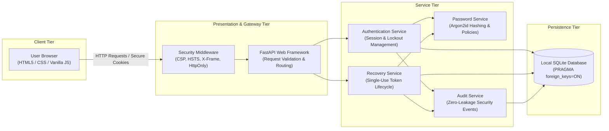
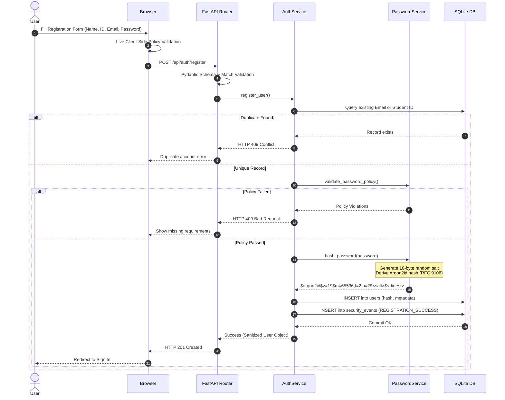
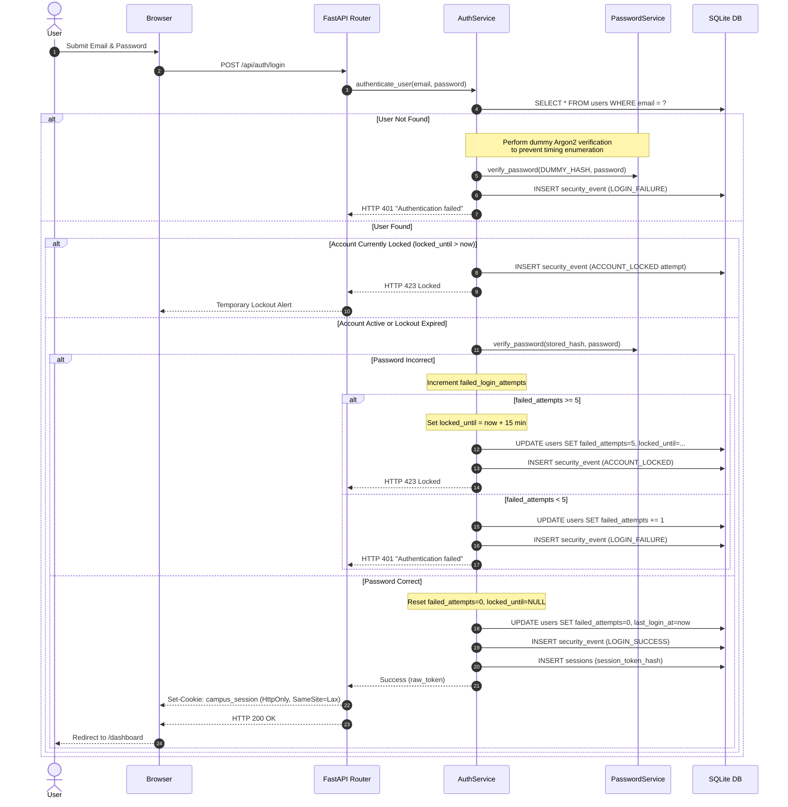
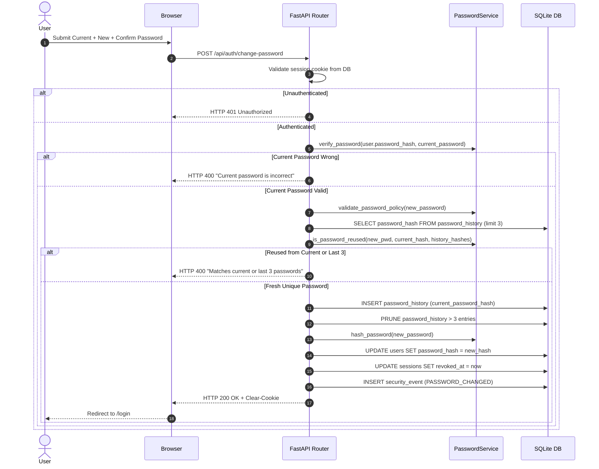
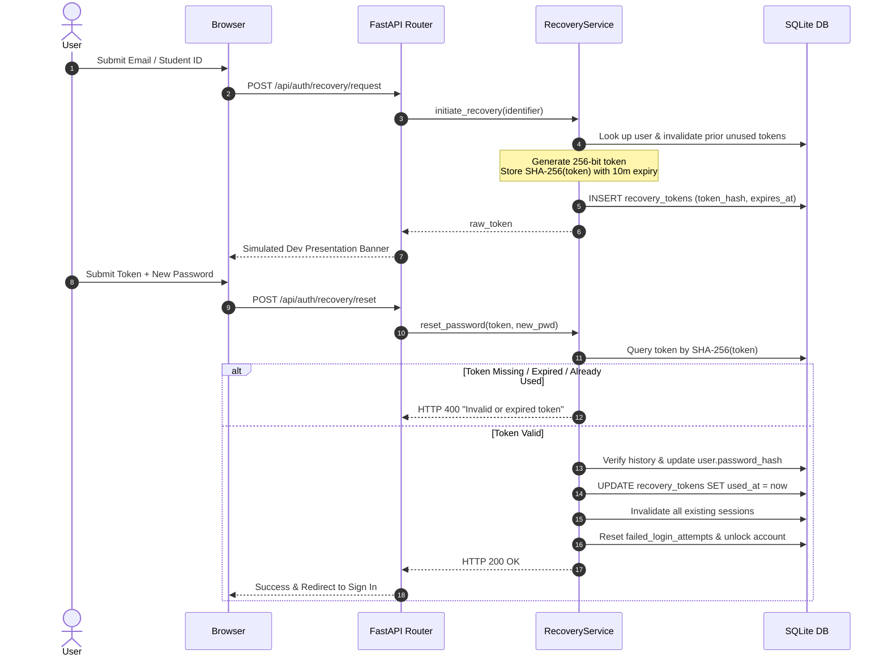
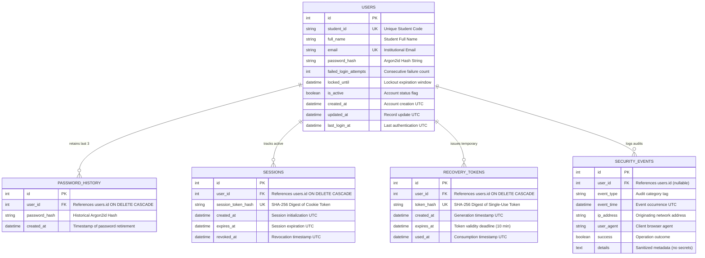

# System Architecture & Technical Design

## 1. High-Level Architecture Overview

The **Secure Campus Portal** implements a defense-in-depth, 4-tier security architecture designed to preserve credential confidentiality even in the catastrophic event of a database compromise or account dumping attack.

---

## 2. Component Structure

| Component | Technology | Primary Responsibilities |
| :--- | :--- | :--- |
| **User Interface** | HTML5, CSS3, Vanilla JavaScript | Responsive credential entry, live client-side policy evaluation, password toggle, dev recovery assistance. |
| **API Gateway & Routing** | FastAPI, Uvicorn | Request validation (Pydantic), cookie extraction, exception sanitization, static file serving. |
| **Security Middleware** | Starlette BaseHTTPMiddleware | Injects HTTP hardening headers (`Content-Security-Policy`, `X-Content-Type-Options`, `X-Frame-Options`). |
| **Authentication Service** | Python 3 | Coordinates login validation, tracks consecutive failed attempts, enforces temporary lockout windows. |
| **Password Service** | `argon2-cffi` | Argon2id key derivation, 16-byte cryptographically secure random salt generation, constant-time verification, last-3 history check. |
| **Session Service** | Python `secrets`, `hashlib` | Generates 256-bit cryptographically secure session tokens, indexes SHA-256 digests in database, invalidates on logout. |
| **Recovery Service** | Python `secrets`, `hashlib` | Issues time-bounded, single-use reset tokens stored as SHA-256 hashes, handles reset validation. |
| **Audit Service** | Python Logging & SQLAlchemy | Records immutable security events (`LOGIN_FAILURE`, `ACCOUNT_LOCKED`, etc.) while redacting credentials. |
| **Local Database** | SQLite, SQLAlchemy ORM | Enforces foreign keys, unique constraints, and indexes without storing plaintext secrets. |

---

## 3. Sequence Diagrams

### 3.1 User Registration Flow (TC-01, TC-03, TC-06 to TC-09)

### 3.2 Authentication & Account Lockout Flow (TC-01, TC-02, TC-05)

### 3.3 Password Change & History Flow (TC-04, TC-11 to TC-13)

### 3.4 Account Recovery Flow (TC-16, TC-17)

---

## 4. Database Schema & Entity-Relationship Architecture

